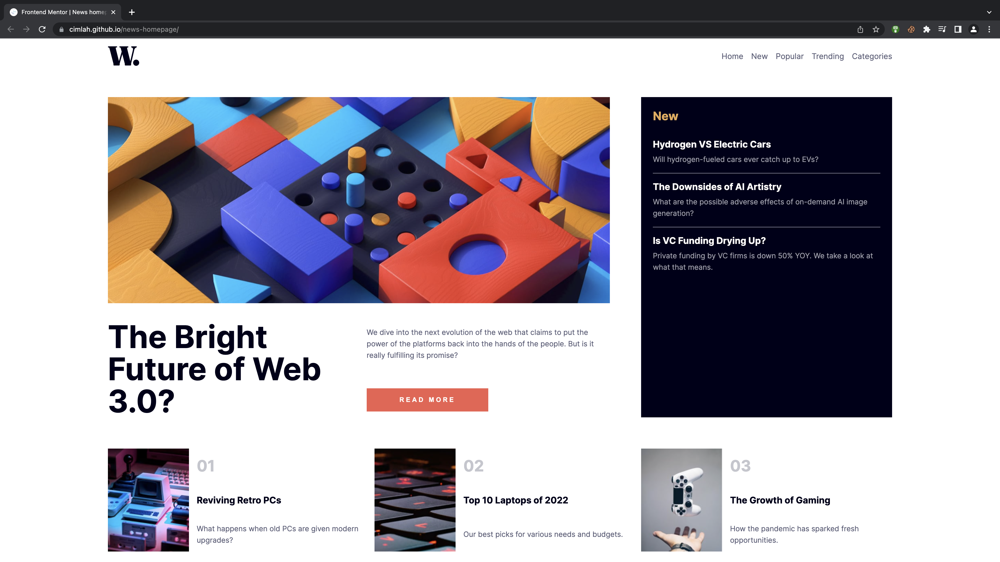

# Frontend Mentor - News homepage solution

This is a solution to the [News homepage challenge on Frontend Mentor](https://www.frontendmentor.io/challenges/news-homepage-H6SWTa1MFl). Frontend Mentor challenges help you improve your coding skills by building realistic projects. 

## Table of contents

- [Overview](#overview)
  - [The challenge](#the-challenge)
  - [Screenshot](#screenshot)
  - [Links](#links)
- [Author](#author)
- [Acknowledgments](#acknowledgments)

## Overview

### The challenge

Users should be able to:

- View the optimal layout for the interface depending on their device's screen size
- See hover and focus states for all interactive elements on the page
- **Bonus**: Toggle the mobile menu (requires some JavaScript)

### Screenshot

### Links

- Solution URL: [Add solution URL here](https://your-solution-url.com)
- [Live Site URL](https://cimlah.github.io/news-homepage/)

## Author

- Website - [Michał Stolarczyk](https://github.com/Cimlah)
- Frontend Mentor - [@Cimlah](https://www.frontendmentor.io/profile/Cimlah)

## Acknowledgments

Thank you, [@lemmoor](https://github.com/lemmoor/) for help